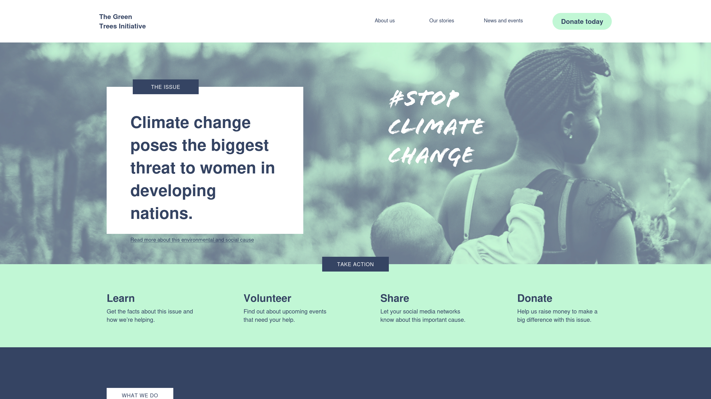
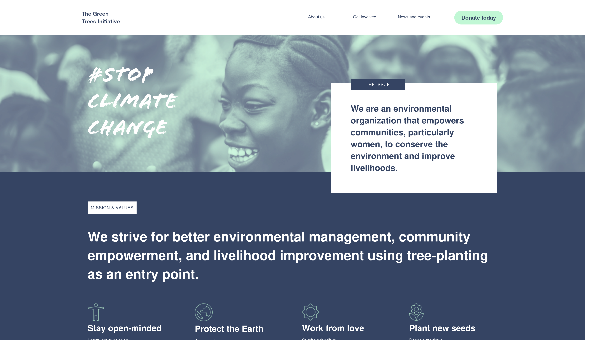
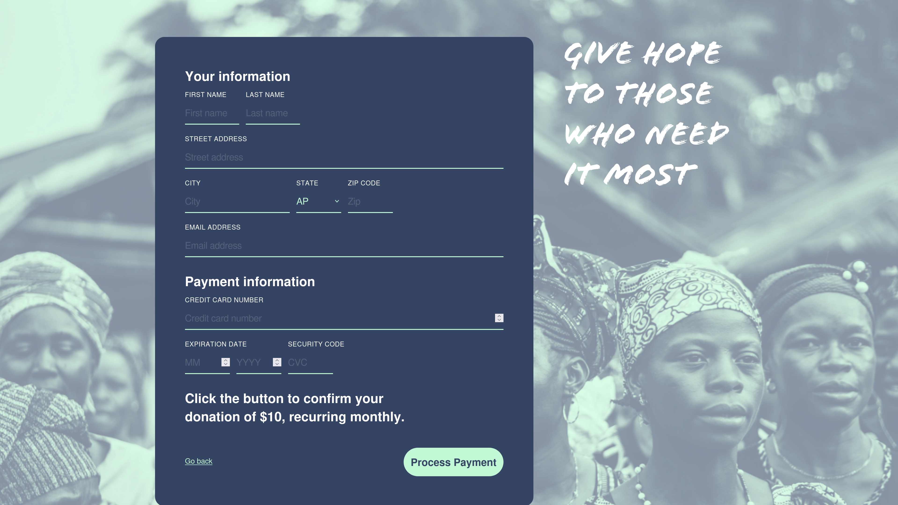
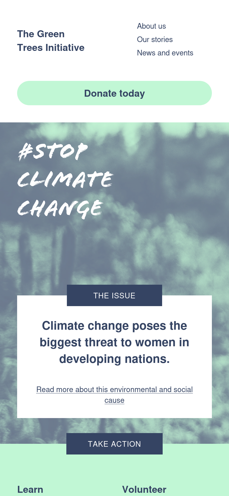
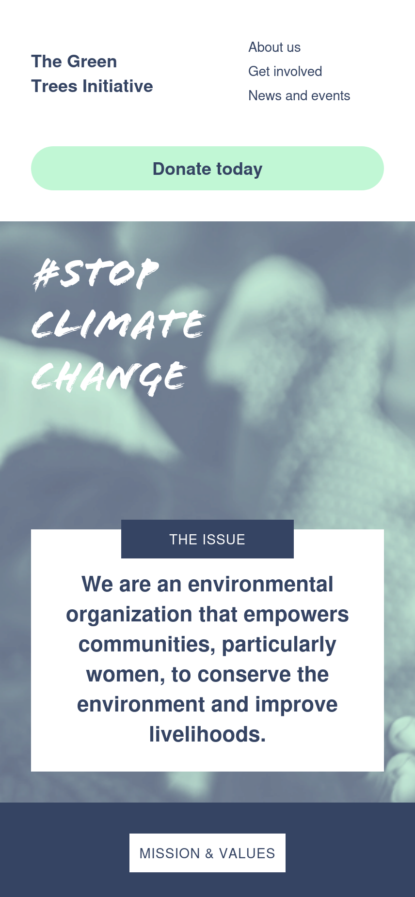
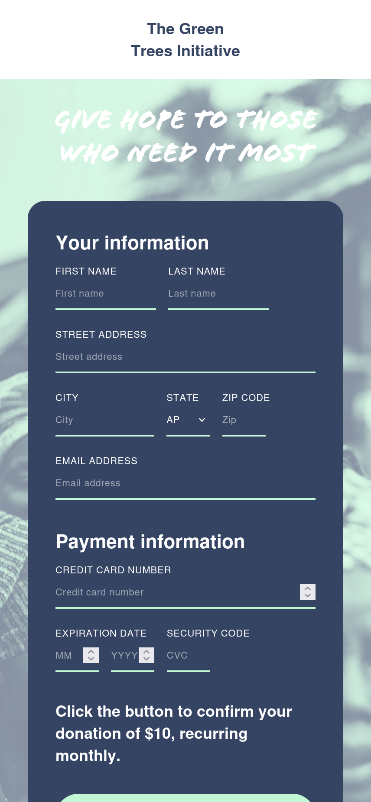

# 🌿 The Green Tree Initiative

A **pixel‑perfect UI website** built from scratch using **HTML** and **vanilla CSS**.  
The site is designed to promote a clean, nature‑inspired aesthetic emphasizing sustainability, harmony, and modern minimalism.

[🌐 Live Demo](https://the-green-tree-initiative.netlify.app/)

---

### 💻 Desktop View

| Home Page | About Page | Donation |
|:---:|:---:|:---:|
|  |  |  |

---

### 📱 Mobile View

| Home Page | About Page | Donation |
|:---:|:---:|:---:|
|  |  |  |

---

### ✨ Features

- Responsive layout that adapts beautifully across devices  
- Clean, semantic HTML structure  
- Organized CSS for easy scalability and maintenance  
- Subtle animations and hover effects for smooth interactions  
- Designed with pixel‑perfect precision for professional quality

---

### 🛠️ Technologies Used

| Technology | Purpose |
|-------------|----------|
| HTML5 | Structure and content |
| CSS3 | Styling and layout |
| Netlify | Hosting and deployment |

---

### 💡 Design Goals

- Achieve **pixel‑perfect alignment** using pure CSS  
- Demonstrate front‑end craftsmanship without frameworks  
- Provide a visually appealing, eco‑themed layout suitable for environmental or community initiatives
